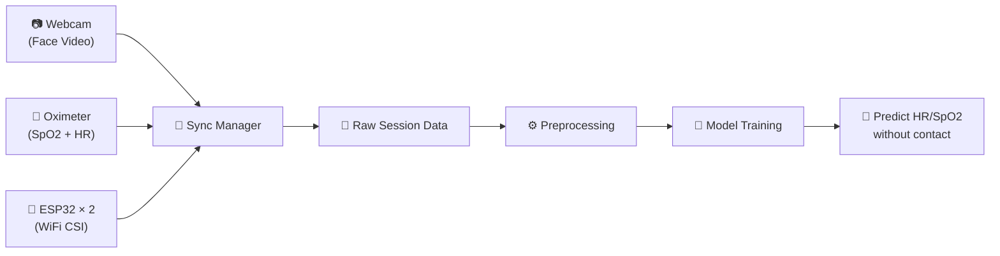
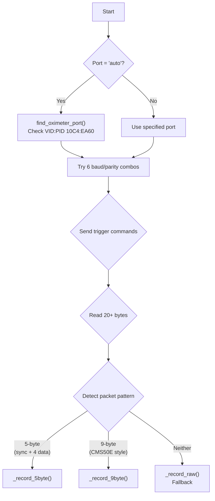
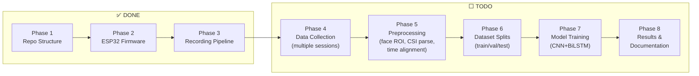

# 📡 Dataset Sync — Complete Project Walkthrough

## 🎯 What This Project Does

You're building a **contactless heart-rate / SpO2 prediction system**. The idea:

1. **Record simultaneously** from 3 sensors: a webcam (face video), a pulse oximeter (ground truth), and two ESP32s (WiFi CSI signals)
2. **Preprocess** the data — extract face ROI from video, parse CSI subcarriers, align all timestamps
3. **Train a deep learning model** that predicts cardiovascular signals from the **non-contact** sensors (camera + WiFi CSI), using the oximeter readings as **ground truth**



---

## 📁 File-by-File Breakdown

### Root-Level Scripts (Your Test/Debug Tools)

| File | Purpose | Status |
|------|---------|--------|
| [live_oximetry.py](file:///home/jarvis/Dataset_Sync/live_oximetry.py) | **Brute-force scanner** — Tries all USB ports + baud rates to find the Contec oximeter. No data parsing, just confirms the device is streaming. | ✅ Working |
| [cms50e_capture.py](file:///home/jarvis/Dataset_Sync/cms50e_capture.py) | **Advanced protocol capture** — Tries multiple baud/parity combos, then attempts frame alignment by looking for header bytes (0xAA, 0x0D, etc). Prints raw decoded frames. | ✅ Working |
| [cms50e_live.py](file:///home/jarvis/Dataset_Sync/cms50e_live.py) | **Minimal serial reader** — Hardcoded to `/dev/ttyUSB0` at 9600 baud. Prints every byte as an integer. Simplest possible test. | ✅ Working |
| [oximeter_test.py](file:///home/jarvis/Dataset_Sync/oximeter_test.py) | **HID device reader** — For the CMS60D specifically. Looks for `/dev/hidraw*` devices with Contec's USB VID:PID (`28e9:028a`). Reads raw 8-byte HID frames. | ✅ Working |

> [!TIP]
> These 4 scripts at the root are **debug/test tools** you used to crack the oximeter protocol. They are **NOT** part of the main pipeline. The real recording happens in `src/recorder/`.

---

### The Core Pipeline (`src/recorder/`)

This is the actual recording system. All 4 files work together:

#### 1. [session.py](file:///home/jarvis/Dataset_Sync/src/recorder/session.py) — Session Manager

Creates the recording session directory structure:

```
data/raw/session_20260428_093000/
├── camera/          # Frames (JPGs) + timestamps.csv
├── oximeter/        # oximeter_log.csv (SpO2, HR, waveform)
├── csi/             # csi_log.csv + csi_timestamped.csv
└── metadata.json    # Full session metadata
```

**Key concept**: `self.t0 = time.monotonic()` — This is the **shared clock origin**. Every recorder subtracts `session.t0` from the current monotonic time, so all timestamps are relative to the same starting point.

#### 2. [camera_recorder.py](file:///home/jarvis/Dataset_Sync/src/recorder/camera_recorder.py) — Camera Thread

- Opens webcam via OpenCV (`cv2.VideoCapture`)
- Saves frames as individual JPGs (or as a video file)
- Writes `timestamps.csv`: `frame_idx, timestamp_s, filename`
- Rate-limited to target FPS (default 30)

#### 3. [oximeter_recorder.py](file:///home/jarvis/Dataset_Sync/src/recorder/oximeter_recorder.py) — Oximeter Thread (568 lines — the most complex)

The big one. Auto-detects the Contec oximeter through 3 approaches:



**Protocol details**:
- **5-byte** (CMS50D+ style): `[sync_byte | waveform | flags+pulse_hi | pulse_lo | SpO2]`
  - Sync byte has bit 7 = 1, data bytes have bit 7 = 0
  - ~60 Hz sample rate
- **9-byte** (CMS50E style): Similar but wider packets
- **Raw fallback**: Saves all bytes to `.bin` file + tries to parse on the fly

**Triggers sent**: Multiple command sequences (`0xA7`, 9-byte commands, single bytes) to activate streaming on different firmware versions.

#### 4. [csi_recorder.py](file:///home/jarvis/Dataset_Sync/src/recorder/csi_recorder.py) — WiFi CSI Thread

- Reads serial lines from ESP32 receiver at 115200 baud (default)
- ESP32 outputs CSV lines like: `timestamp_ms,rssi,len,amp[0],amp[1],...,amp[63]`
- Saves `csi_log.csv` (raw from ESP32) + `csi_timestamped.csv` (with session timestamps prepended)
- ~100 packets/second expected

#### 5. [sync_manager.py](file:///home/jarvis/Dataset_Sync/src/recorder/sync_manager.py) — The Orchestrator

Ties everything together:

```
1. Parse CLI arguments (duration, subject, ports, feature flags)
2. Create Session → makes directories + sets t0
3. Initialize recorders (Camera, Oximeter, CSI)
4. Countdown (3...2...1... 🔴 RECORDING!)
5. Start all recorder threads
6. Wait for duration, printing live stats every second
7. Stop all recorders
8. Finalize session → write metadata.json
```

---

### ESP32 Firmware (`firmware/`)

| Directory | Role | WiFi Mode |
|-----------|------|-----------|
| [firmware/transmitter/](file:///home/jarvis/Dataset_Sync/firmware/transmitter/) | Sends WiFi packets continuously | **Station** (connects to receiver's AP) |
| [firmware/receiver/](file:///home/jarvis/Dataset_Sync/firmware/receiver/) | Captures CSI from incoming packets | **AP** (creates its own network) |

Both are ESP-IDF projects. The receiver extracts CSI (Channel State Information) — the amplitude/phase of WiFi subcarriers — which changes when a person breathes or their heart beats.

---

### Config Files

| File | Controls |
|------|----------|
| [recording_config.yaml](file:///home/jarvis/Dataset_Sync/config/recording_config.yaml) | Device ports, camera resolution/FPS, baud rates, session settings |
| [model_config.yaml](file:///home/jarvis/Dataset_Sync/config/model_config.yaml) | ML hyperparameters, preprocessing settings, model architecture, training config |

---

### Not Yet Implemented (TODOs)

| File | Phase | What It Will Do |
|------|-------|----------------|
| [video_preprocessor.py](file:///home/jarvis/Dataset_Sync/src/preprocessing/video_preprocessor.py) | Phase 5 | Face detection (MediaPipe) → ROI extraction → Mean RGB/YCbCr → Bandpass filter |
| [rppg_csi_model.py](file:///home/jarvis/Dataset_Sync/src/models/rppg_csi_model.py) | Phase 7 | 1D-CNN + BiLSTM for CSI → BVP prediction |
| [train.py](file:///home/jarvis/Dataset_Sync/src/models/train.py) | Phase 7 | Training loop with early stopping, checkpointing, logging |

---

## 🚀 Step-by-Step: How to Run Everything

### Phase 0: Prerequisites

```bash
# 1. You need Python 3.9+ (you're using 3.10 via conda)
# 2. You need ESP-IDF installed (for flashing ESP32s)
# 3. Linux with USB ports
```

### Phase 1: Install Python Dependencies

```bash
cd ~/Dataset_Sync

# Option A: Using conda (recommended)
conda env create -f environment.yml
conda activate dataset_sync

# Option B: Using venv + pip
python -m venv venv && source venv/bin/activate
pip install -r requirements.txt
pip install -e .     # Installs the 'src' package in editable mode
```

> [!IMPORTANT]
> `pip install -e .` is essential! Without it, `from src.recorder.session import Session` will fail with `ModuleNotFoundError`.

### Phase 2: Flash ESP32 Firmware

You need **two ESP32 boards**. Flash them separately:

```bash
# Terminal 1 — Flash the TRANSMITTER
cd ~/Dataset_Sync/firmware/transmitter
idf.py build
idf.py -p /dev/ttyUSB2 flash    # ← adjust port to your TX board

# Terminal 2 — Flash the RECEIVER
cd ~/Dataset_Sync/firmware/receiver
idf.py build
idf.py -p /dev/ttyUSB1 flash    # ← adjust port to your RX board
```

> [!WARNING]
> After flashing, the ESP32 receiver will occupy a `/dev/ttyUSB*` port. The transmitter only needs power — it doesn't send data back to the PC. Make sure you note which port is the receiver!

### Phase 3: Connect & Test Hardware

#### 3a. Identify Serial Ports

```bash
# After plugging in everything:
ls /dev/ttyUSB* /dev/ttyACM*

# See which device is on which port:
dmesg | grep tty

# Typical mapping:
# /dev/ttyUSB0 → Contec Oximeter (Silicon Labs CP210x)
# /dev/ttyUSB1 → ESP32 Receiver
# /dev/ttyUSB2 → ESP32 Transmitter (only needed for flashing)
```

#### 3b. Fix Permissions (One-Time)

```bash
sudo usermod -aG dialout $USER
# LOG OUT and LOG BACK IN for this to take effect!
```

#### 3c. Test the Oximeter

```bash
# Quick test — just see if it's streaming:
python live_oximetry.py

# Should print:
# ✅ SUCCESS! Active stream found.
# 👉 PORT: /dev/ttyUSB0
# 👉 BAUD: 115200 (or 19200)
```

> [!IMPORTANT]
> The oximeter must be:
> 1. **Plugged in** via USB cable
> 2. **Turned ON**
> 3. **Finger probe attached** (with a finger in it — it won't stream without a reading)
> 4. Some models need **"Upload" mode** enabled in their internal menu

#### 3d. Test the Camera

```bash
# Quick check:
ls /dev/video*

# Or more detailed:
v4l2-ctl --list-devices
```

#### 3e. Test ESP32 CSI

```bash
# After flashing, check if receiver is streaming:
# (Use screen or minicom to read serial)
screen /dev/ttyUSB1 115200
# You should see CSV lines with CSI data
# Press Ctrl+A then K to exit screen
```

### Phase 4: Run a Recording Session! 🎬

```bash
cd ~/Dataset_Sync

# Full recording — all 3 modalities, 60 seconds:
python -m src.recorder.sync_manager \
    --duration 60 \
    --subject "subject_01"

# With specific ports:
python -m src.recorder.sync_manager \
    --duration 120 \
    --subject "subject_01" \
    --oximeter-port /dev/ttyUSB0 \
    --csi-port /dev/ttyUSB1 \
    --camera-id 0

# Record WITHOUT CSI (if ESP32s aren't set up yet):
python -m src.recorder.sync_manager \
    --duration 60 \
    --subject "subject_01" \
    --no-csi

# Record ONLY the oximeter:
python -m src.recorder.sync_manager \
    --duration 60 \
    --subject "subject_01" \
    --no-camera --no-csi
```

**What happens during recording:**
```
============================================================
  📡 Dataset Sync — Synchronized Recording
============================================================
  Session   : session_20260428_093000
  Subject   : subject_01
  Duration  : 60 seconds
  Output    : data/raw/session_20260428_093000
------------------------------------------------------------
  🎥 Camera   : device 0
  💓 Oximeter : auto
  📶 CSI      : /dev/ttyUSB1
============================================================

  Starting in 3...
  Starting in 2...
  Starting in 1...
  🔴 RECORDING!

  ⏱️  15s / 60s  |  🎥 450 frames | 💓 900 samples | 📶 1500 packets
```

### Phase 5: Check Your Output

```bash
ls data/raw/session_*/

# You should see:
# camera/         → frame_000000.jpg, frame_000001.jpg, ..., timestamps.csv
# oximeter/       → oximeter_log.csv (timestamp_s, spo2, heart_rate, pulse_waveform, ...)
# csi/            → csi_log.csv, csi_timestamped.csv
# metadata.json   → Complete session metadata
```

---

## 📋 Quick-Reference Checklist

Before every recording session, check:

- [ ] **Conda/venv activated** — `conda activate dataset_sync`
- [ ] **Oximeter ON** — Turned on, USB cable plugged in, finger in probe
- [ ] **Camera plugged in** — Check `ls /dev/video*`
- [ ] **ESP32-TX powered** — Just needs USB power
- [ ] **ESP32-RX connected** — USB to PC, data streaming
- [ ] **Serial permissions** — User in `dialout` group
- [ ] **Ports identified** — `dmesg | grep tty` to verify mapping

---

## 🔧 Troubleshooting

| Problem | Likely Cause | Fix |
|---------|-------------|-----|
| `ModuleNotFoundError: No module named 'src'` | Package not installed | Run `pip install -e .` from project root |
| `Permission denied: /dev/ttyUSB0` | User not in dialout group | `sudo usermod -aG dialout $USER` + logout/login |
| Oximeter: "No valid Contec stream found" | Device off / no finger / wrong mode | Turn ON, insert finger, enable "Upload" in menu |
| Camera: "Cannot open camera device 0" | Camera not plugged or wrong ID | Check `ls /dev/video*`, try `--camera-id 1` |
| CSI: "Cannot open /dev/ttyUSB1" | ESP32 not plugged or wrong port | Check `dmesg \| grep tty` |
| Oximeter falls back to "raw" mode | Protocol not detected | Try all test scripts first; ensure firmware matches |
| ESP32 no CSI data | TX/RX not on same WiFi channel | Check `sdkconfig.defaults` in both firmware dirs |
| `pyserial` import error | Wrong environment | Activate your conda/venv environment |

---

## 🗺️ What's Left to Build



Your next step after collecting data is implementing [video_preprocessor.py](file:///home/jarvis/Dataset_Sync/src/preprocessing/video_preprocessor.py) (Phase 5) and the model in [rppg_csi_model.py](file:///home/jarvis/Dataset_Sync/src/models/rppg_csi_model.py) (Phase 7).
